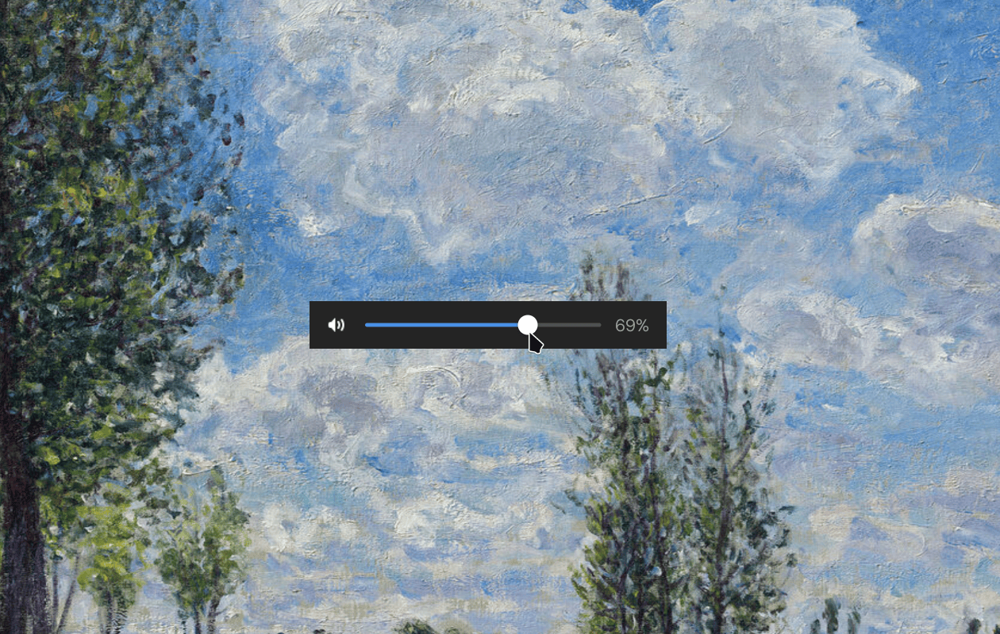

# `zosd`

`zosd` (`/ˈzɔsd/`, like "zossed" or "exhaust" without the initial e) is an interactive on-screen display widget for Wayland that displays information front and center.

No more reaching for status bars on the periphery of your vision, or hooking up Bash scripts to hackily display an overlay while simultaneously calling `amixer`/`wpctl`/`pactl`/`brightnessctl`/etc. `zosd` takes it the right way around and provides reactive, visual feedback and intuitive controls to your actions, working out of the box with minimal configuration.

## Usage

Just run `zosd`. Command-line parameters will be added later, but my intention is to keep them as few as possible.

## Dependencies

- Zig 0.14.0 (later versions, including nightly/development versions, are not guaranteed to work!)
- GTK 4
- libadwaita
- gtk4-layer-shell
- PulseAudio (`libpulse`, `libpulse-mainloop-glib`)

And for actually running `zosd`, you need to use a compositor that supports the `wlr-layer-shell-v1` protocol. If you don't know whether your compositor is supported, it most likely is, unless you use GNOME.

## Contributing

All contributions welcome. The sole supported development environment is defined via the Nix flake, but you should be able to compile `zosd` after installing the development packages of the aforementioned libraries, plus some near-universal utilities like `pkg-config`.

## License

[MIT](https://mit-license.org/)
